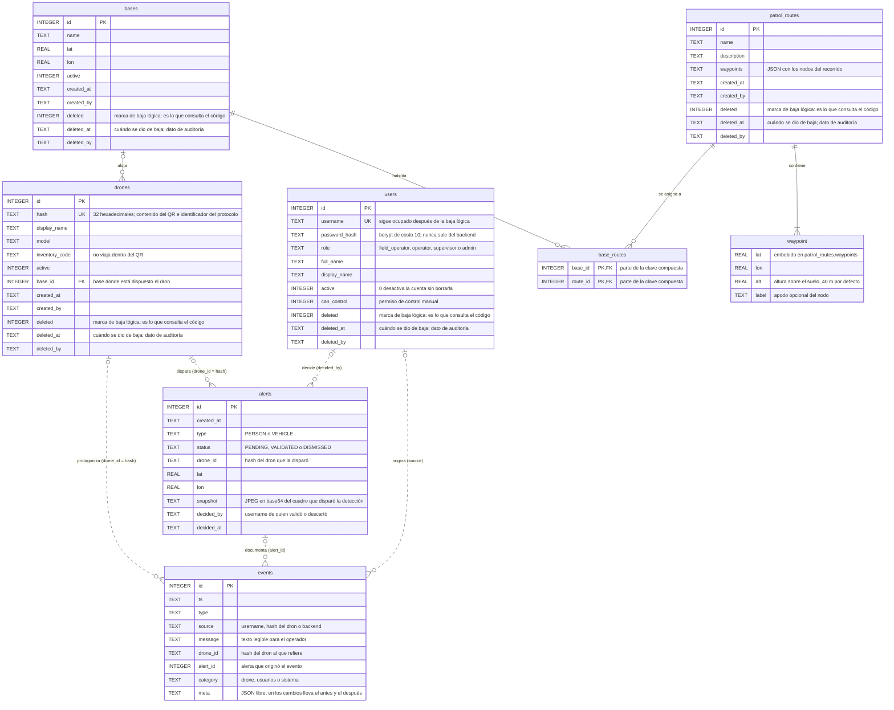
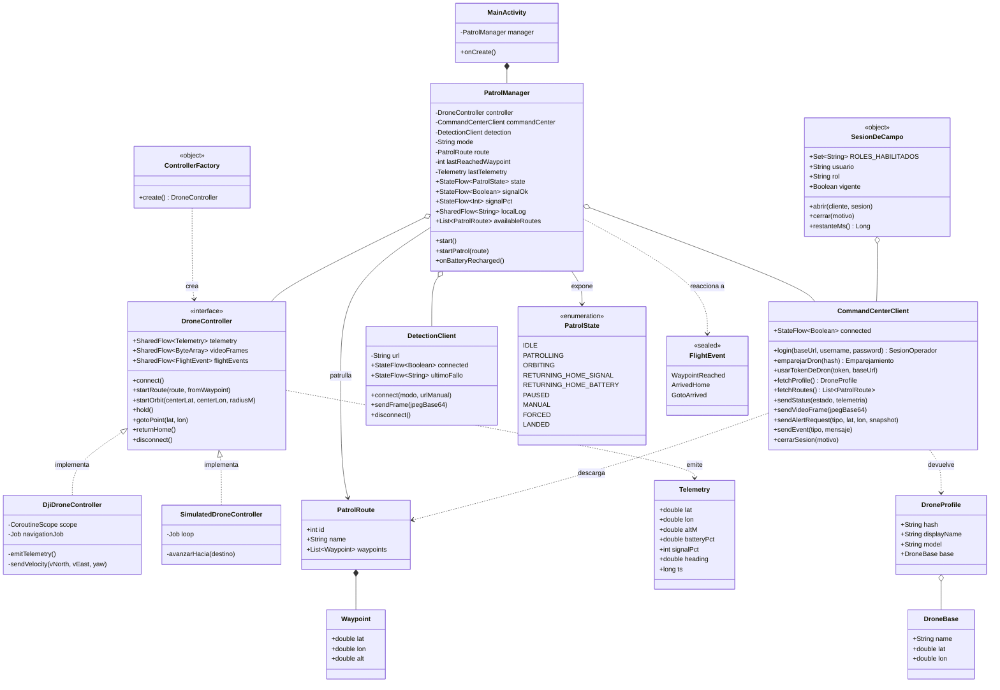
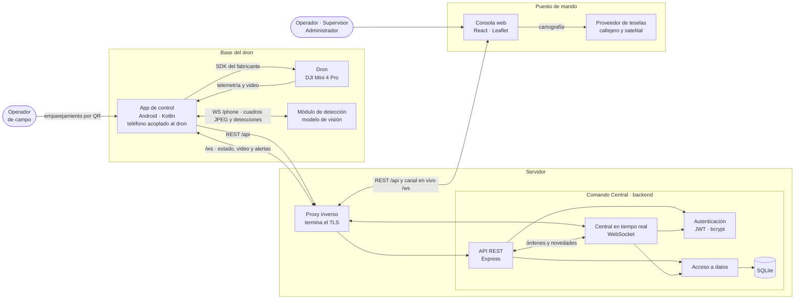

# Modelo de datos y arquitectura

Los tres diagramas de este documento describen el sistema desde tres ángulos:
qué se guarda (entidad-relación), cómo está armado el software que vuela el dron
(clases) y qué piezas se hablan entre sí (componentes).

Están escritos en Mermaid, así que GitHub los dibuja solo al abrir el archivo y
se pueden exportar como imagen sin herramientas aparte.

---

## 1. Diagrama entidad-relación

El almacenamiento es una única base SQLite (`backend/src/db.ts`). Siete tablas y
una estructura embebida.

Dos cosas para leer el diagrama:

- **Línea llena**: clave foránea declarada en el esquema.
- **Línea punteada**: referencia lógica, resuelta en el código y no por el motor.
  Son deliberadas: `alerts.drone_id` y `events.drone_id` guardan el `hash` del
  dron y no su `id`, porque el hash es el identificador del dron en todo el
  protocolo y sobrevive a la baja lógica del activo. El historial tiene que
  seguir resolviendo aunque el dron ya no exista.

### Referencias de auditoría

Además de las relaciones del diagrama, cinco columnas guardan el `username` de
quien hizo cada cosa. No son claves foráneas a propósito: la cuenta puede darse
de baja y el registro tiene que seguir diciendo quién fue.

| Tabla | Columnas | Apunta a |
|---|---|---|
| `drones`, `bases`, `patrol_routes` | `created_by`, `deleted_by` | `users.username` |
| `users` | `deleted_by` | `users.username` |
| `alerts` | `decided_by` | `users.username` |
| `events` | `source` | `users.username`, `drones.hash` o el literal `backend` |

### Decisiones que explican la forma del modelo

- **El dron es un activo, no una cuenta.** Nació como una fila de `users` con
  rol `drone` y se promovió a tabla propia. La migración reapunta todo el
  historial del username viejo al hash nuevo, para no perder trazabilidad.
- **La base es una entidad, no una columna.** Vivía embebida en cada dron, con
  el nombre y la coordenada copiados fila por fila. La migración las promovió a
  `bases`, agrupando por coordenada para que los drones que compartían base
  terminen apuntando a una sola, y después borró las columnas: hoy el único
  vínculo es `drones.base_id`.
- **`base_routes` es una relación de muchos a muchos.** Una base puede tener
  varias rutas y una ruta puede servir a varias bases: el operador elige, entre
  las de su base, cuál patrullar.
- **Todo el borrado es lógico, y la baja es una marca propia.** Ninguna baja
  borra la fila: se prende `deleted` y se anotan `deleted_at` y `deleted_by`. La
  consulta va siempre contra la marca y nunca contra la fecha —la fecha es el
  dato de auditoría, no el interruptor—, así que una fila con la fecha en blanco
  por un error de escritura no puede pasar por viva ni al revés. Por eso también
  el `UNIQUE` de `username` se mantiene después de la baja.
- **Renombrar una base se ve en el acto en todos sus drones**, justamente
  porque el dato vive en un solo lugar y no hay copias que sincronizar.
- **Los nodos de una ruta van embebidos.** Se leen y se escriben siempre
  completos, con la ruta, y nunca se consultan por separado. Una tabla aparte
  agregaría un join a cada lectura sin habilitar ninguna consulta que el sistema
  necesite.

---

## 2. Diagrama de clases — app de control

La app Android es la parte del sistema con una estructura de clases propiamente
dicha. El `PatrolManager` es el cerebro: sostiene la máquina de estados, los
watchdogs y los dos failsafes, y habla con el aparato únicamente a través de la
interfaz `DroneController`. Esa abstracción es la que permite cambiar de
fabricante sin tocar la lógica de vuelo.

### Cómo se lee

- **`DroneController` es el punto de corte con el hardware.** El `PatrolManager`
  no sabe qué aparato está volando. Las dos implementaciones cumplen el mismo
  contrato y se eligen en tiempo de compilación con `ControllerFactory`.
- **La comunicación va por flujos, no por llamadas de vuelta.** La telemetría,
  el video y los eventos de vuelo salen como `SharedFlow`, con capacidad acotada
  y emisión que no bloquea el lazo de captura.
- **El `PatrolManager` concentra la seguridad.** Los dos failsafes —regreso por
  batería baja y regreso por pérdida de enlace— se disparan desde cualquier
  estado en vuelo, incluidos control manual y desvío forzado.

---

## 3. Diagrama de componentes

Cuatro piezas de software, dos aparatos y dos servicios externos. Cada flecha
lleva el protocolo por el que se hablan.

### Interfaces

| Entre | Protocolo | Qué viaja |
|---|---|---|
| Consola web ↔ backend | REST sobre HTTPS | altas, bajas y consultas de usuarios, drones, bases, rutas, alertas y registro |
| Consola web ↔ backend | WebSocket | telemetría de la flota, video, alertas y eventos en vivo |
| App de control ↔ backend | REST sobre HTTPS | inicio de sesión de campo, emparejamiento, ficha del dron y rutas de su base |
| App de control ↔ backend | WebSocket | estado del dron, cuadros de video, pedidos de alerta y órdenes de vuelo |
| App de control ↔ módulo de detección | WebSocket | cuadros JPEG hacia el módulo, detecciones de vuelta |
| App de control ↔ dron | SDK del fabricante | órdenes de vuelo, telemetría y video |
| Consola web ↔ proveedor de teselas | HTTPS | cartografía de fondo, callejera y satelital |

La consola web la entrega el propio backend como archivos estáticos: no hay un
servidor web aparte.

El enlace con el módulo de detección admite dos modos: por el cable de datos,
con un túnel local que no expone el tráfico a la red y no exige escribir ninguna
dirección, y por red con una URL configurable.
